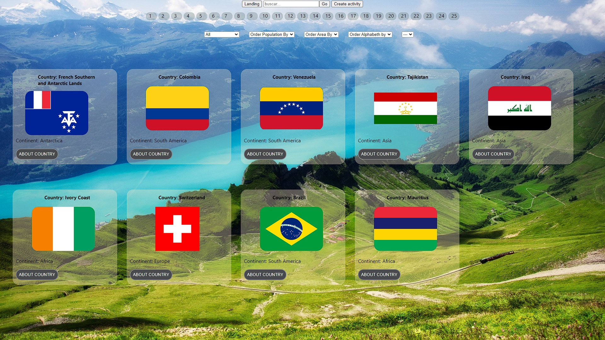
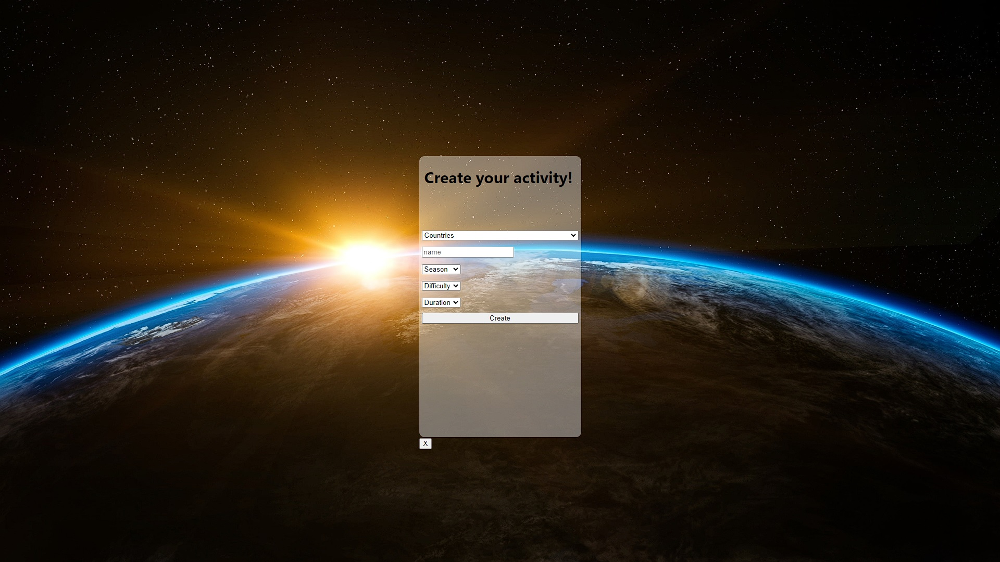

#### Soy un Full Stack Developer con experiencia en desarrollo de aplicaciones Front-End y Back-End
#### que busca seguir ampliando conocimientos asi sea en un equipo o de manera autodidacta 
#### para poder plasmarlo en un escenario real de trabajo.😊

---

### Actualmente estoy trabajando en el proyecto final del HenryBootcamp 👋

---

## Contactame:

[Linkedin](https://www.linkedin.com/in/matias-filliez-fullstackdeveloper/)

---

## Mi Stack de tecnologias:

- JavaScript
- TypeScript
- React
- Redux
- Node.Js
- Express
- PostgresSQL
- Sequelize

---

## Proyecto Individual Full Stack realizado

#### LANDING PAGE:

---

#### MAIN PAGE:

## 

---

#### DETAIL PAGE:

---

#### CREATEACTIVITY PAGE:

